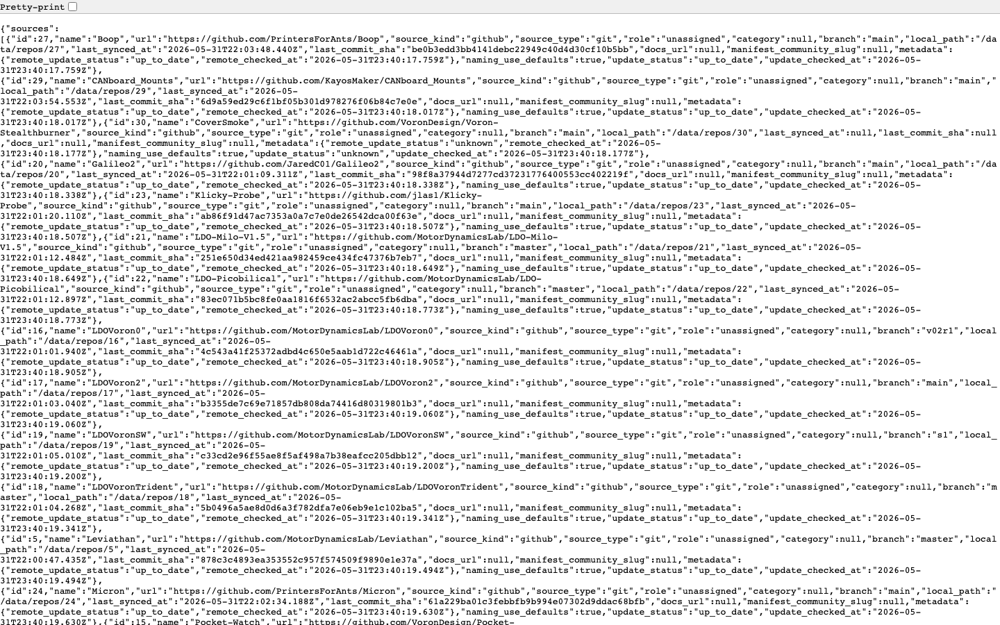
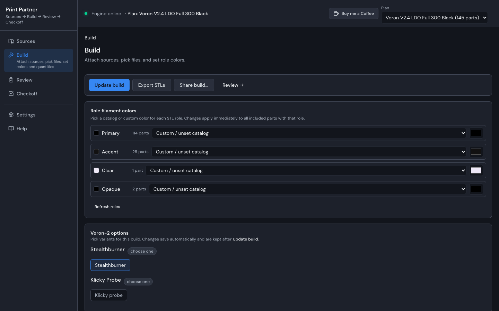
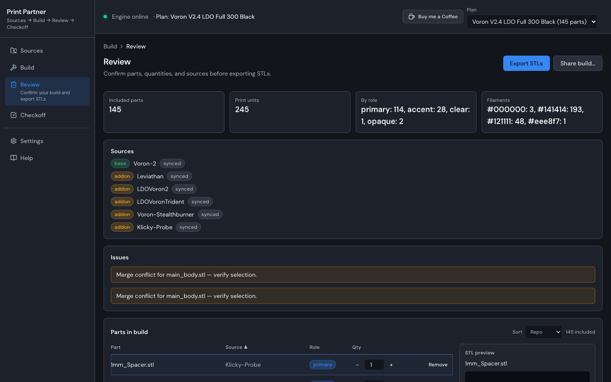
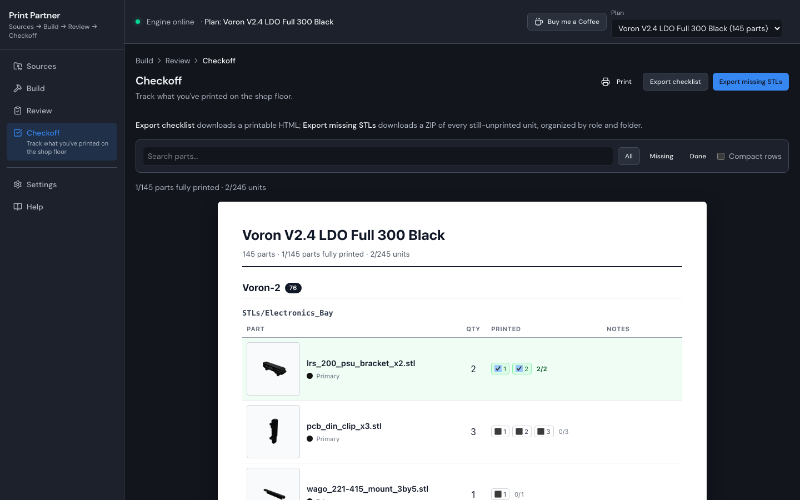

# Print Partner

**Print Partner** is a self-hostable web app for layered STL kit workflows — base repo plus add-ons, accent parts, quantities baked into filenames, and a pile of folders to keep straight. It syncs GitHub (or local) repos and walks you through **Sources → Build → Review → Checkoff**.

It ships as a single container: a **Fastify** API and a **React** single-page app served together on one port. Run it on your own machine or a small server with `docker compose up --build`, and your data lives in a `/data` volume. A multi-tenant **SaaS** mode (Postgres + S3 + OAuth) is available for hosted deployments.

---

## What it does

| Step | What you are doing |
|------|--------------------|
| **Sources** | Add GitHub repos, local folders, or zips; assign categories; search STLs across every synced repo; see **update available** badges; sync and set import rules. |
| **Build** | Pick **role filament colors** (primary/accent), attach sources, choose files and quantities; **Update build**; read repo docs inline; pick kit/manifest options; export STLs or share a plan bundle. |
| **Review** | Confirm a validation summary grouped by role and filament, browse the full included-parts list with 3D STL previews, and **Export STLs** by role and folder. |
| **Checkoff** | Track per-unit print progress (saved per plan), filter missing/done, print the checklist, and **Export missing STLs** for the next batch. |

---

## Screenshots

### Sources



The source library: add GitHub repos, local folders, or zips and group them into **categories**. Each source shows its sync state and an **update-available** badge when the upstream repo has moved. A global search box finds STLs by filename or path across every synced repo, and per-source **import rules** control how files are picked up.

### Build



Pick **role filament colors** (primary/accent) at the top, attach sources, then choose files and quantities. **Update build** recomputes the plan. The inline **Docs viewer** renders a repo's README and Markdown without leaving the app, and kit/manifest options apply curated presets. From here you can **export STLs** or **share a plan bundle**.

### Review



A **validation summary** grouped by role and filament surfaces any issues before you print. The full included-parts list shows **3D STL previews** and can be sorted by repo or filename. **Export STLs** writes parts organized by role and folder.

### Checkoff



Mark **per-unit print progress** (saved per plan) and filter to what is missing or done. On-scroll **3D thumbnails** are laid out like a printable checklist. Use **Print** for a paper checklist, **Export checklist HTML**, or **Export missing STLs** (zip) to hand the outstanding units straight to the next print batch.

---

## Quick start — Docker self-host

**Requirements:** Docker with Compose v2.

From the repository root:

```bash
docker compose up --build
```

Open [http://localhost:8080](http://localhost:8080). Data persists in the `print-partner-data` volume, mounted at `/data` inside the container (SQLite database, synced repos, exports, and thumbnails).

### Environment variables (self-host)

Defaults match `web/apps/server/src/config.ts`; the Docker image overrides `HOST`, `PORT`, `PRINT_PARTNER_DATA_DIR`, and `STATIC_DIR` (see `Dockerfile`).

| Variable | Default | Description |
|----------|---------|-------------|
| `PRINT_PARTNER_DATA_DIR` | `./data` (`/data` in Docker) | SQLite DB, synced repos, exports, thumbnails |
| `HOST` | `127.0.0.1` (`0.0.0.0` in Docker) | Bind address |
| `PORT` | `18765` (dev) / `8080` (Docker) | HTTP port |
| `STATIC_DIR` | unset | When set, the server also serves the built SPA from this directory (single-port mode) |
| `DEPLOY_MODE` | `self-host` | `self-host` or `saas` |
| `CORS_ORIGIN` / `ALLOWED_ORIGINS` | `true` | Allowed CORS origin(s); comma-separated list for multiple (`ALLOWED_ORIGINS` takes precedence) |
| `BASIC_AUTH_USER` / `BASIC_AUTH_PASS` | unset | Optional HTTP Basic protection |
| `UPLOAD_MAX_BYTES` | `536870912` | Multipart upload / request body limit (512 MiB) |
| `PP_VERSION` | `0.1.0-web` | Version reported by `GET /health` |

See [`web/DEPLOY.md`](web/DEPLOY.md) for the full reference, including SaaS variables and desktop-data migration.

---

## Run locally without Docker

**Requirements:** Node 22.

```bash
cd web
npm ci
npm run dev
```

This runs both apps with hot reload:

- **UI** (Vite) — [http://127.0.0.1:5173](http://127.0.0.1:5173)
- **API** (Fastify) — [http://127.0.0.1:18765](http://127.0.0.1:18765) (`/health`)

### Production-like single-port run

Build everything, then run the server with `STATIC_DIR` pointing at the built SPA so the API and UI share one port:

```bash
cd web
npm ci
npm run build
STATIC_DIR="$(pwd)/apps/web/dist" PORT=8080 HOST=127.0.0.1 \
  node apps/server/dist/index.js
```

Open [http://localhost:8080](http://localhost:8080).

---

## SaaS mode

Set `DEPLOY_MODE=saas` to enable multi-tenant hosting: Postgres for app data (when `DATABASE_URL` is set), S3-compatible blob storage (when `S3_BUCKET` is set), and GitHub OAuth. A ready-to-run stack with Postgres 16 and MinIO is provided:

```bash
docker compose -f docker-compose.saas.yml up --build
```

See [`web/DEPLOY.md`](web/DEPLOY.md) for SaaS environment variables, auth routes, and S3 configuration.

---

## Architecture / monorepo layout

The application lives in the `web/` TypeScript monorepo; the `Dockerfile` and Compose files stay at the repository root.

| Package | Path | Role |
|---------|------|------|
| `@print-partner/web` | `web/apps/web` | Vite + React single-page app |
| `@print-partner/server` | `web/apps/server` | Fastify API (also serves the SPA in single-port mode) |
| `@print-partner/contracts` | `web/packages/contracts` | Shared API types |
| `@print-partner/domain` | `web/packages/domain` | Framework-agnostic domain logic |

```text
.
├── Dockerfile                 # self-host image (API + SPA, single port)
├── docker-compose.yml         # self-host (SQLite, port 8080)
├── docker-compose.saas.yml    # SaaS (Postgres + MinIO/S3 + OAuth)
└── web/
    ├── apps/web               # React SPA
    ├── apps/server            # Fastify API
    └── packages/              # contracts, domain
```

The server uses a **ports/adapters** design: a `self-host` adapter (SQLite + local disk) and a `saas` adapter (Postgres + S3) implement the same ports. STL rendering happens client-side with Three.js, and long-running work (sync, recompute, exports) runs in a background job runner that streams progress over a WebSocket. See [`docs/ARCHITECTURE.md`](docs/ARCHITECTURE.md) for details.

---

## License & attribution

Print Partner is licensed under the **[Print Partner Non-Commercial Software License](LICENSE)**. Plain-language summary: [LICENSE-SUMMARY.md](LICENSE-SUMMARY.md).

Print Partner is inspired by [Annex Engineering](https://github.com/Annex-Engineering) workflow conventions, used with permission — see [ATTRIBUTION.md](ATTRIBUTION.md).

- **[COMMERCIAL.md](COMMERCIAL.md)** — commercial print farms may use the app internally; contact for commercializing the **software**
- **[THIRD_PARTY_NOTICES.md](THIRD_PARTY_NOTICES.md)** — bundled dependency notices

---

## Links

- [Project site (GitHub Pages)](https://poitee.github.io/PrintPartnerPartner/) — landing page with workflow screenshots
- [`web/DEPLOY.md`](web/DEPLOY.md) — Docker Compose, env vars, SaaS, and desktop-data migration
- [`docs/ARCHITECTURE.md`](docs/ARCHITECTURE.md) — system design
- [`CHANGELOG.md`](CHANGELOG.md) — release history
- [`LICENSE`](LICENSE) — full license text
