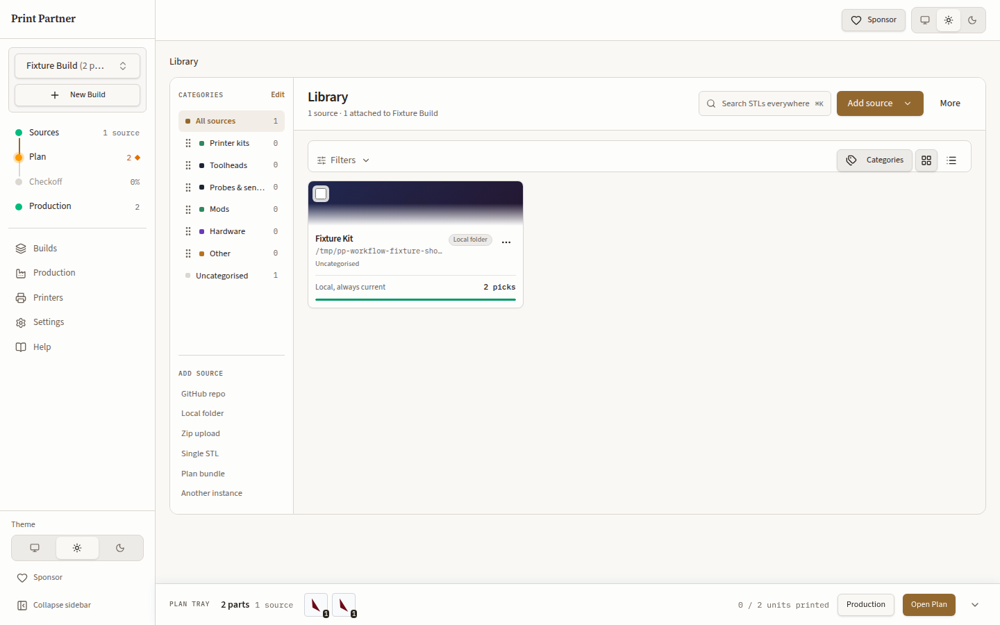
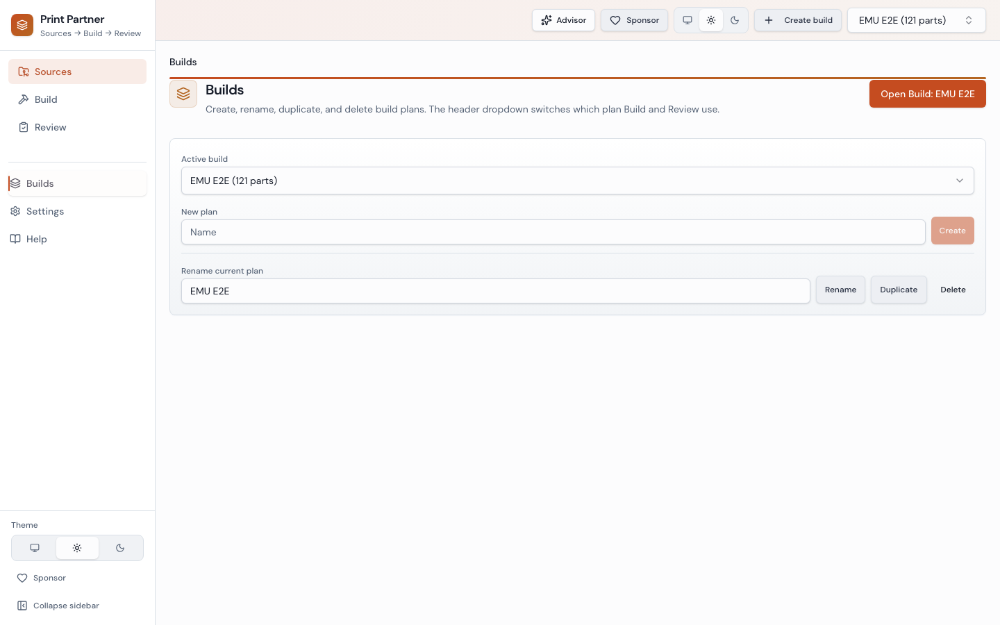
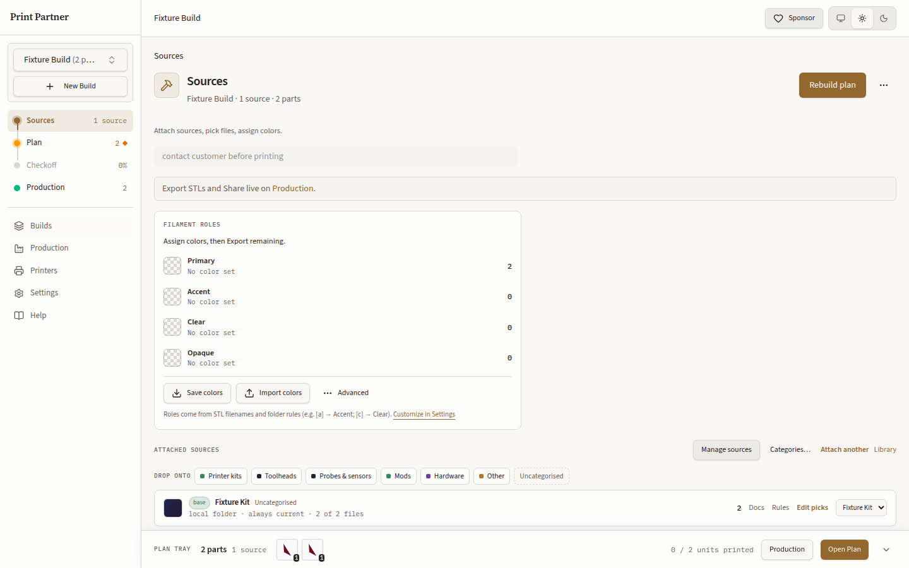
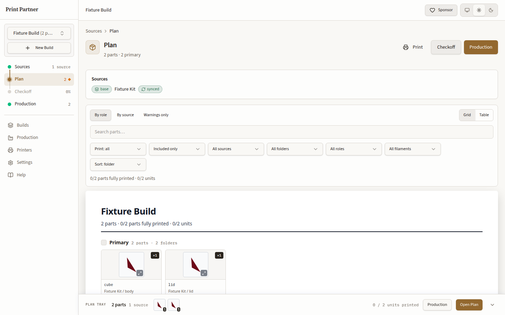
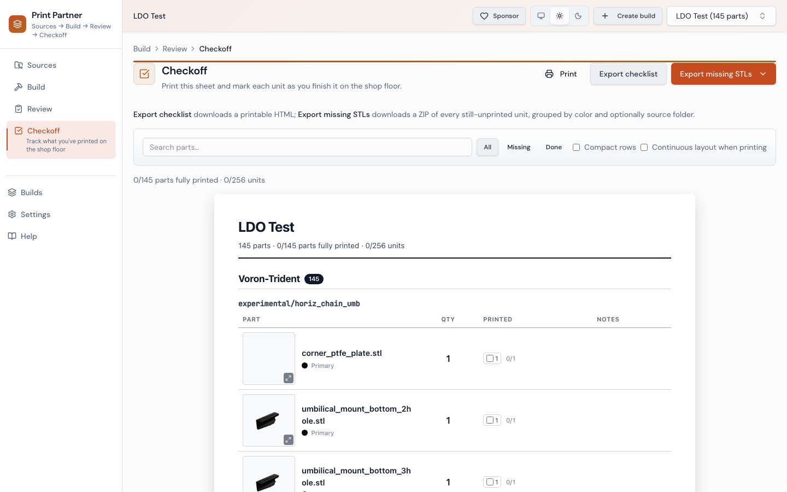

<p align="center">
  
</p>

<h1 align="center">Print Partner</h1>

<p align="center">
  <strong>Self-hostable web workflow for layered STL kits</strong><br>
  Base repo plus add-ons, accent parts, quantities in filenames, and a pile of folders to keep straight.
</p>

<p align="center">
  <a href="https://github.com/sponsors/poitee"></a>
</p>

<p align="center">
  <a href="https://poitee.github.io/PrintPartnerPartner/">Project site</a>
  ·
  <a href="#quick-start--docker-self-host">Quick start</a>
  ·
  <a href="#screenshots">Screenshots</a>
  ·
  <a href="docs/ARCHITECTURE.md">Architecture</a>
  ·
  <a href="LICENSE-SUMMARY.md">License</a>
</p>

<p align="center">
  <code>Sources</code> → <code>Build</code> → <code>Review</code> → <code>Checkoff</code>
</p>

<p align="center">
  <sub>
    Plan management — header <strong>Create build</strong>, <strong>Manage builds</strong> on Build, or the sidebar <strong>Builds</strong> page.
  </sub>
</p>

<p align="center">
  <sub>
    Ships as a single Docker container — <strong>Fastify</strong> API + <strong>React</strong> SPA on one port.
    Warm UI with <strong>light</strong>, <strong>dark</strong>, or <strong>system</strong> theme. Data stays in a volume you control.
    Multi-tenant <strong>SaaS</strong> mode (Postgres + S3 + OAuth) is available for hosted deployments.
  </sub>
</p>

---

## What it does

| Step | What you are doing |
|------|--------------------|
| **Sources** | Add GitHub repos, local folders, or zips; assign categories; search STLs across every synced repo; see **update available** badges; sync and set import rules. |
| **Build** | **Manage builds** (create/switch plans), attach base/add-on sources, pick STL files, set **role filament colors** (previews update live), **Update build** when stale, kit/manifest options, inline repo **Docs**, export STLs or share a plan bundle. |
| **Review** | Confirm a validation summary grouped by role and filament, browse the full included-parts list with 3D STL previews, edit quantities, and **Export STLs** by role and folder. |
| **Checkoff** | Track per-unit print progress (saved per plan), filter missing/done, print the checklist, and **Export missing STLs** for the next batch. |

**Managing builds** (not a pipeline step): use the header **Create build** button and plan picker, the collapsible **Manage builds** panel on Build, or the **Builds** page in the sidebar to create, rename, duplicate, and delete plans. The active plan is shared across Build, Review, and Checkoff.

**Tips:** **⌘K / Ctrl+K** opens the command palette (sync, recompute, exports, navigation). Collapse the left sidebar to an icon rail; the first-run **Progress** widget hides after you complete Sources through Checkoff once. Open **Help** in the sidebar for the full workflow guide.

Optional **[Spoolman](docs/integrations/SPOOLMAN.md)** integration: connect a Spoolman instance in Settings to pick filaments from your inventory on Build and see read-only spool remaining weights in Review / Checkoff.

---

## Screenshots

Screenshots switch with your GitHub **light / dark** theme (or see both on the [project site](https://poitee.github.io/PrintPartnerPartner/)).

### Sources

<picture>
  <source media="(prefers-color-scheme: dark)" srcset="docs/screenshots/dark/sources.png">
  <source media="(prefers-color-scheme: light)" srcset="docs/screenshots/light/sources.png">
  
</picture>

Source library: categories, sync status, **update available** badges, global STL search, per-source import rules.

### Builds

<picture>
  <source media="(prefers-color-scheme: dark)" srcset="docs/screenshots/dark/builds.png">
  <source media="(prefers-color-scheme: light)" srcset="docs/screenshots/light/builds.png">
  
</picture>

Sidebar **Builds** page plus the same controls in **Manage builds** on Build and the header plan picker.

### Build

<picture>
  <source media="(prefers-color-scheme: dark)" srcset="docs/screenshots/dark/build.png">
  <source media="(prefers-color-scheme: light)" srcset="docs/screenshots/light/build.png">
  
</picture>

**Manage builds**, role colors, attach sources, pick STLs (live 3D preview), **Update build** when stale, kit options, **Docs**, export and share.

### Review

<picture>
  <source media="(prefers-color-scheme: dark)" srcset="docs/screenshots/dark/review.png">
  <source media="(prefers-color-scheme: light)" srcset="docs/screenshots/light/review.png">
  
</picture>

Validation summary by role and filament, full parts list with **3D previews**, quantity edits, **Export STLs**.

### Checkoff

<picture>
  <source media="(prefers-color-scheme: dark)" srcset="docs/screenshots/dark/checkoff.png">
  <source media="(prefers-color-scheme: light)" srcset="docs/screenshots/light/checkoff.png">
  
</picture>

Per-unit progress, on-scroll **3D thumbnails**, printable checklist, **Export missing STLs** for the next batch.

---

## Quick start — Docker self-host

**Requirements:** Docker with Compose v2.

From the repository root, pull the pre-built image from GitHub Container Registry and start it:

```bash
docker compose pull && docker compose up -d
```

Open [http://localhost:8080](http://localhost:8080). Data persists in the `print-partner-data` volume, mounted at `/data` inside the container (SQLite database, synced repos, exports, and thumbnails).

Images are published to **`ghcr.io/poitee/print-partner`** (`latest` plus a tag per release, e.g. `3.0.0`). To build from source instead:

```bash
docker compose up --build
```

**New to Docker?** See the step-by-step guide in [`docs/INSTALL.md`](docs/INSTALL.md). Quick checklist:

1. Install [Docker Desktop](https://docs.docker.com/get-docker/) (or Docker Engine + Compose on Linux) and verify `docker compose version`.
2. Clone this repo and `cd` into it.
3. Run `docker compose pull && docker compose up -d` (or `docker compose up --build` to build from source).
4. Open [http://localhost:8080](http://localhost:8080).
5. Add a **Source** on the Sources page, then create a build with **Create build** in the header or **Manage builds** on Build (or open **Builds** in the sidebar).

### Environment variables (self-host)

Defaults match `web/apps/server/src/config.ts`; the Docker image overrides `HOST`, `PORT`, `PRINT_PARTNER_DATA_DIR`, and `STATIC_DIR` (see `Dockerfile`).

| Variable | Default | Description |
|----------|---------|-------------|
| `PRINT_PARTNER_DATA_DIR` | `./data` (`/data` in Docker) | SQLite DB, synced repos, exports, thumbnails |
| `HOST` | `127.0.0.1` (`0.0.0.0` in Docker) | Bind address |
| `PORT` | `18765` (dev) / `8080` (Docker) | HTTP port |
| `STATIC_DIR` | unset | When set, the server also serves the built SPA from this directory (single-port mode) |
| `DEPLOY_MODE` | `self-host` | `self-host` or `saas` |
| `MULTI_USER` | `0` (self-host) / `1` (saas default) | Enable login, per-user data, and in-app sharing |
| `SESSION_SECRET` | unset | Required when `MULTI_USER=1` or OAuth in production |
| `SMTP_HOST` / `SMTP_FROM` | unset | Send password reset emails (see [`web/DEPLOY.md`](web/DEPLOY.md)) |
| `APP_PUBLIC_URL` | unset | Public URL for reset links when behind a reverse proxy |
| `GITHUB_CLIENT_ID` / `GITHUB_CLIENT_SECRET` / `GITHUB_CALLBACK_URL` | unset | GitHub OAuth |
| `DISCORD_CLIENT_ID` / `DISCORD_CLIENT_SECRET` / `DISCORD_CALLBACK_URL` | unset | Discord OAuth |
| `CORS_ORIGIN` / `ALLOWED_ORIGINS` | `true` | Allowed CORS origin(s); comma-separated list for multiple (`ALLOWED_ORIGINS` takes precedence) |
| `BASIC_AUTH_USER` / `BASIC_AUTH_PASS` | unset | Optional HTTP Basic protection |
| `UPLOAD_MAX_BYTES` | `536870912` | Multipart upload / request body limit (512 MiB) |
| `PP_VERSION` | `3.0.0-web` (baked into release images) | Version reported by `GET /health` |
| `PRINT_PARTNER_UPDATE_CHECK` | enabled | Set to `0` to disable in-app update checks |
| `GITHUB_REPO` | `poitee/PrintPartnerPartner` | GitHub repo for release lookup |
| `PRINT_PARTNER_LATEST_VERSION` | unset | Air-gapped: compare against this version instead of GitHub |

The app optionally checks GitHub for newer releases and shows a subtle banner plus **Settings → About & updates**. Self-host Docker upgrade: `docker compose pull && docker compose up -d`.

See [`web/DEPLOY.md`](web/DEPLOY.md) for the full reference, including SaaS variables and desktop-data migration.

---

## Run locally without Docker

**Requirements:** Node 22.

```bash
cd web
npm ci
npm run dev
```

`npm run dev` runs a **predev** step that builds `@print-partner/contracts` and `@print-partner/domain` before starting the API and UI. On a fresh clone, `npm ci && npm run dev` is enough — you do not need a separate `npm run build` first.

- **UI** (Vite) — [http://127.0.0.1:5173](http://127.0.0.1:5173)
- **API** (Fastify) — [http://127.0.0.1:18765](http://127.0.0.1:18765) (`/health`)

### Production-like single-port run

Build everything, then run the server with `STATIC_DIR` pointing at the built SPA so the API and UI share one port:

```bash
cd web
npm ci
npm run build
STATIC_DIR="$(pwd)/apps/web/dist" PORT=8080 HOST=127.0.0.1 \
  node apps/server/dist/index.js
```

Open [http://localhost:8080](http://localhost:8080).

---

## SaaS mode

Set `DEPLOY_MODE=saas` to enable multi-tenant hosting: Postgres for app data (when `DATABASE_URL` is set), S3-compatible blob storage (when `S3_BUCKET` is set), and GitHub OAuth. A ready-to-run stack with Postgres 16 and RustFS (S3-compatible) is provided:

```bash
docker compose -f docker-compose.saas.yml up --build
```

See [`web/DEPLOY.md`](web/DEPLOY.md) for SaaS environment variables, auth routes, and S3 configuration.

---

## Architecture / monorepo layout

The application lives in the `web/` TypeScript monorepo; the `Dockerfile` and Compose files stay at the repository root.

| Package | Path | Role |
|---------|------|------|
| `@print-partner/web` | `web/apps/web` | Vite + React single-page app |
| `@print-partner/server` | `web/apps/server` | Fastify API (also serves the SPA in single-port mode) |
| `@print-partner/contracts` | `web/packages/contracts` | Shared API types |
| `@print-partner/domain` | `web/packages/domain` | Framework-agnostic domain logic |

```text
.
├── Dockerfile                 # self-host image (API + SPA, single port)
├── docker-compose.yml         # self-host (SQLite, port 8080)
├── docker-compose.saas.yml    # SaaS (Postgres + RustFS/S3 + OAuth)
└── web/
    ├── apps/web               # React SPA
    ├── apps/server            # Fastify API
    └── packages/              # contracts, domain
```

The server uses a **ports/adapters** design: a `self-host` adapter (SQLite + local disk) and a `saas` adapter (Postgres + S3) implement the same ports. STL rendering happens client-side with Three.js, and long-running work (sync, recompute, exports) runs in a background job runner that streams progress over a WebSocket. See [`docs/ARCHITECTURE.md`](docs/ARCHITECTURE.md) for details.

---

## Support

If Print Partner saves you time on a kit build, **[GitHub Sponsors](https://github.com/sponsors/poitee)** helps fund development. Sponsorships are voluntary and do not grant commercial license rights — see [LICENSE-SUMMARY.md](LICENSE-SUMMARY.md).

---

## License & attribution

Print Partner is licensed under the **[Creative Commons Attribution-NonCommercial 4.0 International License (CC BY-NC 4.0)](LICENSE)**. Plain-language summary: [LICENSE-SUMMARY.md](LICENSE-SUMMARY.md).

Print Partner builds on work shared by the **3D Printing Community** and by **[ThunderKeys' STL Manifest Generator](https://github.com/thunderkeys/stl-manifest-generator)** — see [ATTRIBUTION.md](ATTRIBUTION.md).

- **[THIRD_PARTY_NOTICES.md](THIRD_PARTY_NOTICES.md)** — bundled dependency notices

---

## Links

- [Project site (GitHub Pages)](https://poitee.github.io/PrintPartnerPartner/) — landing page with workflow screenshots
- [`docs/INSTALL.md`](docs/INSTALL.md) — beginner Docker install and first run
- [`web/DEPLOY.md`](web/DEPLOY.md) — Docker Compose, env vars, SaaS, and desktop-data migration
- [`docs/ARCHITECTURE.md`](docs/ARCHITECTURE.md) — system design
- [`CHANGELOG.md`](CHANGELOG.md) — release history
- [`LICENSE`](LICENSE) — full license text
