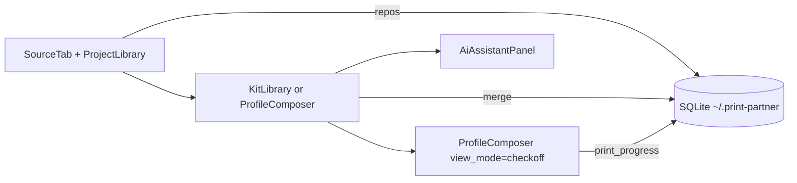

# Print Partner architecture

Local-first PySide6 desktop app: sync STL repositories, compose layered kits, check off prints, export HTML.

## Workflow

1. **Libraries** — `SourceTab`, `ProjectLibrary`, `RepoBrowseTree`, import rules, git sync.
2. **Kit** — `KitLibraryWidget` (list) or `ProfileComposer` (compose/review).
3. **Checkoff** — same `ProfileComposer` instance in `checkoff` view mode; `PrintChecklistWidget`.

Navigation: `WorkflowStrip` + `MainWindow._content_stack` (no widget reparenting between Kit and Checkoff).

## Module map

| Area | Location |
|------|----------|
| App entry | `print_partner.app`, `logging_setup` |
| Config / data dir | `config.py` → `~/.print-partner` |
| ORM + migrations | `db/models.py`, `db/session.py` (`SCHEMA_MIGRATIONS`) |
| Git / local import | `core/git_sync.py`, `core/project_import.py` |
| Merge / scan | `core/merge.py`, `core/scanner.py`, `core/profile_ops.py` |
| Thumbnails | `core/thumbnails.py`, `thumb_*_cli.py` (subprocess isolation) |
| Kit sharing | `core/export_kit_bundle.py` — `.print-partner-kit.zip` JSON bundles |
| UI shell | `ui/main_window.py`, `ui/workflow_strip.py` |
| Kit UI | `ui/profile_composer.py` + `ui/composer/*` mixins |
| Background work | `ui/sync_worker.py`, `recompute_worker.py`, `export_worker.py`, `thumbnail_cache_worker.py` |
| Packaging | `packaging/print_partner.spec`, `build_release.sh` |

## ProfileComposer mixins

- `PartsViewMixin` — parts tree, filters, filament, selection, preview hooks.
- `KitActionsMixin` — wizard, layers, recompute, profile manage.
- `AiIntegrationMixin` — context + apply actions.

## Tests

`pytest` uses an isolated temp data dir via `tests/conftest.py` (never touches live `~/.print-partner`).
