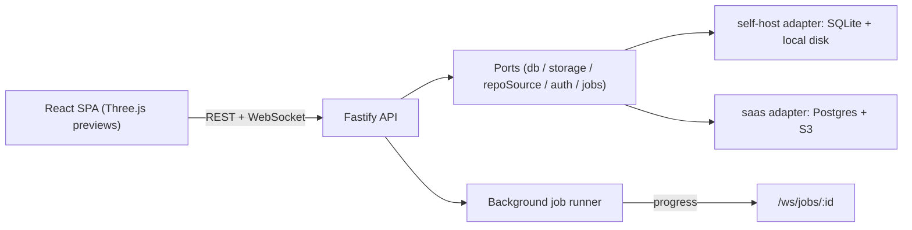
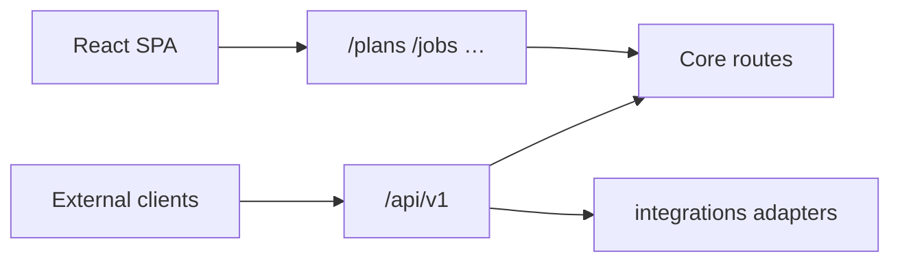
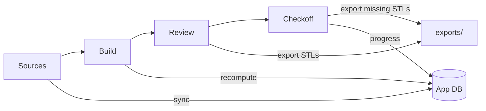

# Print Partner architecture

Kit planning for the web: sync STL repositories, compose layered plans, export STLs by role/folder, and check off prints — served as a single container you can self-host, with an optional multi-tenant SaaS mode.

## Overview

Print Partner is a TypeScript monorepo under `web/`:

| Package | Path | Role |
|---------|------|------|
| `@print-partner/web` | `web/apps/web` | Vite + React single-page app |
| `@print-partner/server` | `web/apps/server` | Fastify API; also serves the SPA in single-port mode |
| `@print-partner/contracts` | `web/packages/contracts` | Shared API types |
| `@print-partner/domain` | `web/packages/domain` | Framework-agnostic domain logic |

In production the Fastify server serves both the API and the built React SPA on **one port**. When `STATIC_DIR` is set, `@fastify/static` serves the SPA from that directory and a not-found handler falls back to `index.html` for client-side routes (`web/apps/server/src/app.ts`). In local dev the two run separately: Vite UI on `:5173`, API on `:18765`.

## Single-port serving

- Built SPA assets are served from `STATIC_DIR` (the Docker image sets it to `/app/web/apps/web/dist`).
- API routes (`/sources`, `/plans`, `/parts`, `/jobs`, `/exports`, `/settings`, `/auth`, …) are registered on the same Fastify instance.
- The not-found handler returns `index.html` for extension-less `GET` requests so deep links resolve to the SPA; everything else returns a JSON 404.

## Ports / adapters

The server is built around a small set of ports (`web/apps/server/src/ports/index.ts`): `DbStore`, `StoragePort`, `RepoSource`, `AuthProvider`, and `JobRunner`. `createPorts(config)` in `app.ts` selects an adapter by `DEPLOY_MODE`:

| Concern | self-host (`web/apps/server/src/adapters/self-host`) | saas (`web/apps/server/src/adapters/saas`) |
|---------|------------------------------------------------------|--------------------------------------------|
| App data | SQLite under the data dir | Postgres when `DATABASE_URL` is set, else SQLite fallback |
| Blob storage | Local disk (`SelfHostStoragePort`) | S3-compatible when `S3_BUCKET` is set, else tenant-scoped local disk |
| Tenancy | Single `"default"` tenant | Per-request tenant resolution (header / OAuth / dev anonymous) |
| Auth | None (optional HTTP Basic at the edge) | GitHub OAuth, HTTP Basic, or `SAAS_ALLOW_ANONYMOUS` for dev |

Both adapters expose the same repository API, so routes are written once against `AppRepository` regardless of deploy mode. In SaaS, `repositoryForTenant` returns a tenant-scoped repository; in self-host there is a single shared repository.

## Data layer (Drizzle ORM)

Persistence uses **Drizzle ORM** with two backends selected at startup (`web/apps/server/src/db/database.ts`):

- **SQLite** (`schema.ts`, `client.ts`) — the default for self-host; the database file and synced repos live under `PRINT_PARTNER_DATA_DIR` (`/data` in Docker).
- **Postgres** (`schema-pg.ts`, `client-postgres.ts`) — used in SaaS when `DATABASE_URL` is set; rows are tenant-scoped and migrations run on startup.

File blobs (synced repos, exports, thumbnails) are stored on disk in self-host, and on disk or S3 in SaaS.

## Client rendering

STL previews and the on-scroll Checkoff thumbnails are rendered **client-side with Three.js** in the React SPA — there is no server-side mesh renderer. The browser downloads STL geometry from the API and rasterizes previews locally.

## HTTP API & integrations

- **Versioned surface:** `GET /api/v1` with OpenAPI at `/api/v1/openapi.json` (legacy flat routes remain for the SPA).
- **Automation auth (self-host):** optional `PRINT_PARTNER_API_KEY` for `/api/v1/*`.
- **Integrations:** pluggable adapters under `/api/v1/integrations` (Moonraker test connection first; other vendors stubbed).
- **Fleet presets:** `/printers` bed metadata for 3MF packing — separate from live printer hosts.

See [API.md](./API.md) for slicer polling, exports, and webhooks.

## Background jobs & progress

Long-running work — repo sync, plan recompute, STL pack export, HTML checklist export, and kit-bundle import/export — runs through a background **job runner** (`web/apps/server/src/routes/jobs.ts`). Self-host and SaaS both use the in-process runner by default; SaaS can be backed by a BullMQ/Redis queue (`REDIS_URL`) for horizontal scaling. Clients start a job over REST and subscribe to live progress via the WebSocket at `/ws/jobs/:id`.

## Workflow

1. **Sources** — register GitHub/local/zip sources; categories; import rules; cross-repo STL search; update-available badges.
2. **Build** — set role filament colors, attach sources, pick files and quantities, update build; inline repo Docs viewer; kit/manifest options; export STLs or share a plan bundle.
3. **Review** — validation summary by role/filament; full parts list with 3D previews; export STLs by role and folder.
4. **Checkoff** — per-unit progress (saved per plan), printable checklist, and missing-STL export.

## Deploy modes at a glance

| Mode | App DB | Files | Auth |
|------|--------|-------|------|
| **self-host** | SQLite under `PRINT_PARTNER_DATA_DIR` | Local disk | Optional HTTP Basic |
| **saas** | Postgres (tenant-scoped) | `SAAS_DATA_DIR` or S3 | GitHub OAuth / Basic / dev anonymous |

See [`../web/DEPLOY.md`](../web/DEPLOY.md) for environment variables and Docker Compose details.
