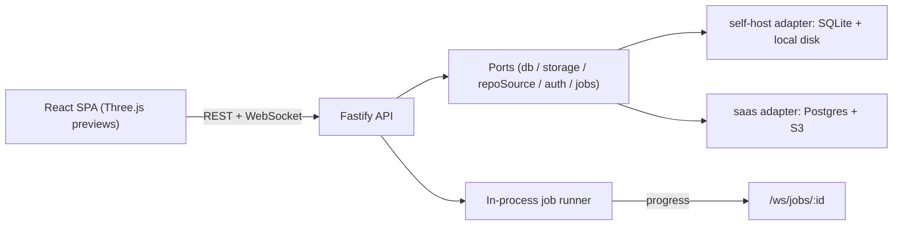
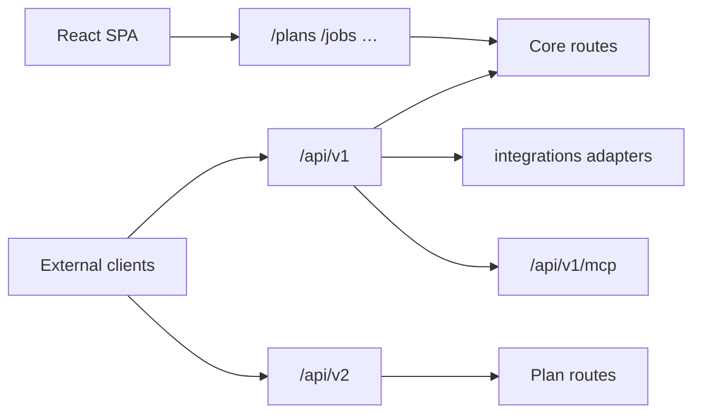
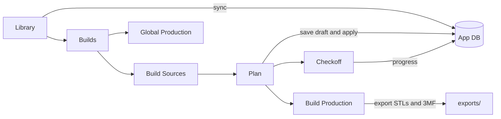
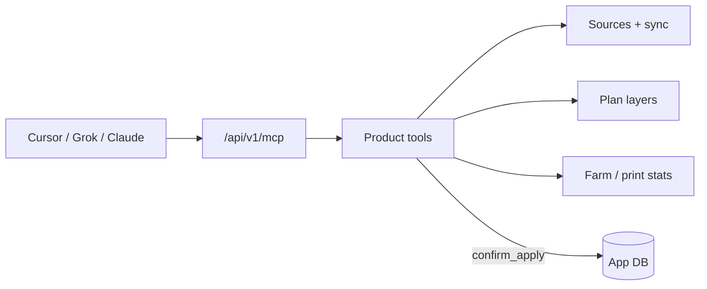

# Print Partner architecture

Kit planning for the web: sync STL repositories, compose Builds, export STLs by role/folder, and check off prints — served as a single container you can self-host. SQLite and local disk are the supported mode. Optional multi-tenant SaaS (Postgres, S3) is experimental.

## Overview

Print Partner is a TypeScript monorepo under `web/`:

| Package | Path | Role |
|---------|------|------|
| `@print-partner/web` | `web/apps/web` | Vite + React single-page app |
| `@print-partner/server` | `web/apps/server` | Fastify API; also serves the SPA in single-port mode |
| `@print-partner/contracts` | `web/packages/contracts` | Shared API types |
| `@print-partner/domain` | `web/packages/domain` | Framework-agnostic domain logic |

In production the Fastify server serves both the API and the built React SPA on **one port**. When `STATIC_DIR` is set, `@fastify/static` serves the SPA from that directory and a not-found handler falls back to `index.html` for client-side routes (`web/apps/server/src/app.ts`). In local dev the two run separately: Vite UI on `:5173`, API on `:18765`.

```mermaid
flowchart LR
  Browser["React SPA (Three.js previews)"] -->|REST + WebSocket| API["Fastify API"]
  API --> Ports["Ports (db / storage / repoSource / auth / jobs)"]
  Ports --> SelfHost["self-host adapter: SQLite + local disk"]
  Ports --> Saas["saas adapter: Postgres + S3"]
  API --> Jobs["In-process job runner"]
  Jobs -->|progress| WS["/ws/jobs/:id"]
```

## Single-port serving

- Built SPA assets are served from `STATIC_DIR` (the Docker image sets it to `/app/web/apps/web/dist`).
- API routes (`/sources`, `/plans`, `/parts`, `/jobs`, `/exports`, `/settings`, `/auth`, …) are registered on the same Fastify instance.
- The not-found handler returns `index.html` for extension-less `GET` requests so deep links resolve to the SPA; everything else returns a JSON 404.

## Ports / adapters

The server is built around a small set of ports (`web/apps/server/src/ports/index.ts`): `DbStore`, `StoragePort`, `RepoSource`, `AuthProvider`, and `JobRunner`. `createPorts(config)` in `app.ts` selects an adapter by `DEPLOY_MODE`:

| Concern | self-host (`web/apps/server/src/adapters/self-host`) | saas (`web/apps/server/src/adapters/saas`) |
|---------|------------------------------------------------------|--------------------------------------------|
| App data | SQLite under the data dir | Supported SQLite fallback; experimental Postgres when explicitly enabled |
| Blob storage | Local disk (`SelfHostStoragePort`) | S3-compatible when `S3_BUCKET` is set, else tenant-scoped local disk |
| Tenancy | Single `"default"` tenant | Per-request tenant resolution (header / OAuth / dev anonymous) |
| Auth | None (optional HTTP Basic at the edge) | GitHub OAuth, HTTP Basic, or `SAAS_ALLOW_ANONYMOUS` for dev |

Both adapters expose the same repository API, so routes are written once against `AppRepository` regardless of deploy mode. In SaaS, `repositoryForTenant` returns a tenant-scoped repository; in self-host there is a single shared repository.

## Data layer (Drizzle ORM)

Persistence uses **Drizzle ORM** with two backends selected at startup (`web/apps/server/src/db/database.ts`):

- **SQLite** (`schema.ts`, `client.ts`) — the default for self-host; the database file and synced repos live under `PRINT_PARTNER_DATA_DIR` (`/data` in Docker).
- **Postgres** (`schema-pg.ts`, `client-postgres.ts`) — experimental in SaaS when `DATABASE_URL` is set. Rows are tenant-scoped and migrations run on startup, but the synchronous compatibility bridge does not provide native repository transaction semantics. Production startup requires `POSTGRES_EXPERIMENTAL=1`; health reports the backend as experimental.

File blobs (synced repos, exports, thumbnails) are stored on disk in self-host, and on disk or S3 in SaaS.

## Client rendering

STL previews and Checkoff thumbnails are rendered **client-side with Three.js** in the React SPA — there is no server-side mesh renderer. The browser downloads STL geometry from the API and rasterizes previews locally. The SPA keeps a small **IndexedDB mesh cache**, decimates heavy meshes for thumbs, and limits concurrent WebGL work so scrolling Checkoff stays responsive.

## HTTP API & integrations

- **Versioned routes:** `/api/v1` keeps legacy numeric Plan summaries and the existing integration routes. `/api/v2` contains only Plan routes with accepted Progress summaries. Both versions have an OpenAPI JSON path generated from Fastify routes that declare schema metadata. Many operational routes exist without those schemas; [API.md](./API.md) is the overview, not a claim that every endpoint is fully specified.
- **Automation auth (self-host):** optional `PRINT_PARTNER_API_KEY` for `/api/v1/*` and `/api/v2/*`.
- **Integrations:** pluggable adapters under `/api/v1/integrations` (Moonraker, PrusaLink, Bambu status, Spoolman, slicer sidecar, Discord, Home Assistant).
- **Fleet presets:** `/printers` bed metadata for 3MF packing — separate from live printer hosts.
- **Live printer hosts:** Moonraker and PrusaLink support status + G-code upload with verify-first Checkoff; Bambu LAN MQTT is status-only. Setup: [integrations/PRINTER_SETUP.md](./integrations/PRINTER_SETUP.md).
- **Ops endpoints:** backups, API key CRUD, logging export, `/metrics`, and rate limits — see [OPERATIONS.md](./OPERATIONS.md).

See [API.md](./API.md) for slicer polling, exports, and webhooks.

```mermaid
flowchart LR
  Clients[External clients] --> V1["/api/v1"]
  Clients --> V2["/api/v2"]
  SPA[React SPA] --> Flat["/plans /jobs …"]
  V1 --> Core[Core routes]
  V2 --> Plans[Plan routes]
  Flat --> Core
  V1 --> Integrations[integrations adapters]
  V1 --> MCP["/api/v1/mcp"]
```

## Background jobs & progress

Long-running work such as repo sync, STL pack export, HTML checklist export, kit-bundle import/export, and accepted Plate 3MF export runs through an **in-process job runner** (`web/apps/server/src/routes/jobs.ts`). There is no Redis or BullMQ queue. Database rows and local artifacts survive a process restart; in-flight job state does not. Clients start a job over REST and subscribe to live progress via the WebSocket at `/ws/jobs/:id`. `GET /health` reports a `deployment` object with the selected database, artifact store, job runner, tenant mode, and support status.

## Workflow

```mermaid
flowchart LR
  Library[Library] --> Builds[Builds]
  Builds --> Sources[Build Sources]
  Sources --> Plan[Plan]
  Plan --> Checkoff[Checkoff]
  Plan --> Production[Build Production]
  Builds --> Global[Global Production]
  Library -->|sync| DB[(App DB)]
  Plan -->|save draft and apply| DB
  Production -->|export STLs and 3MF| FS[exports/]
  Checkoff -->|progress| DB
```

1. **Library** — register GitHub/local/zip sources; categories; import rules; cross-repo STL search; update-available badges.
2. **Builds** — list-first home. New Build asks only for a name and opens Sources. Existing Builds open Plan.
3. **Build Sources** — attach sources, picks, and roles for this Build (`/sources`).
4. **Plan** — quantities, warnings, saved draft, and explicit Apply (`/plan`).
5. **Checkoff** — per-unit progress, assembled toggles, printable checklist (`/progress`). Paper Checkoff uses independent paper tokens.
6. **Build Production** — Printer allocation, Plate editor, 3MF/STL downloads, slicer handoff, and send (`/export?profile=`). Global Production (`/production`) aggregates jobs across Builds.

Plan switching lives in the spine **PlanPicker**; create/rename/duplicate/archive/restore open from **New Build** or the **Builds** page. Settings and Printers sit outside the main production path. Slicer machine, filament, and process profiles stay in the user's slicer.

## MCP attach (kit brain)

Print Partner exposes MCP-shaped **product-verb tools** over streamable HTTP at `/api/v1/mcp` (and optionally a thin stdio MCP server for offline `DATA_DIR` copies). Attach **Cursor / Grok / Claude** — there is **no in-app kit advisor chat** and **no Settings → AI**. Mutations only **propose**; apply with `confirm_apply`. See [assistant-mcp.md](./assistant-mcp.md) and [KIT_ADVISOR.md](./KIT_ADVISOR.md).

```mermaid
flowchart LR
  Agent[Cursor / Grok / Claude] --> MCP["/api/v1/mcp"]
  MCP --> Tools[Product tools]
  Tools --> Sources[Sources + sync]
  Tools --> Plan[Plan layers]
  Tools --> Farm[Farm / print stats]
  Tools -->|"confirm_apply"| DB[(App DB)]
```

- **Confirm-to-apply**: mutating tools write proposals; nothing changes until confirm/dismiss.
- **Domain packs** under `assistant-domain/` remain runtime context (not training). See [Kit brain](./KIT_ADVISOR.md).
- **Decision memory**: Apply/Dismiss write `plan_decisions`; feedback writes `assistant_feedback`. This is ranking/context only — **no fine-tuning**.

## Schema dialects

Self-host defaults to **SQLite** (`schema.ts`, version stamped after DDL). SaaS uses **Postgres** (`schema-pg.ts` + `postgresPostInitMigrations`) with the same `schema_version`. Profile-sync provenance columns (v13) and farm/print_jobs columns (v11–v12) must exist on both dialects.

| Mode | App DB | Files | Auth |
|------|--------|-------|------|
| **self-host** | SQLite under `PRINT_PARTNER_DATA_DIR` | Local disk | Optional HTTP Basic |
| **saas** | Postgres (tenant-scoped) | `SAAS_DATA_DIR` or S3 | GitHub OAuth / Basic / dev anonymous |

See [`../web/DEPLOY.md`](../web/DEPLOY.md) for environment variables and Docker Compose details.
