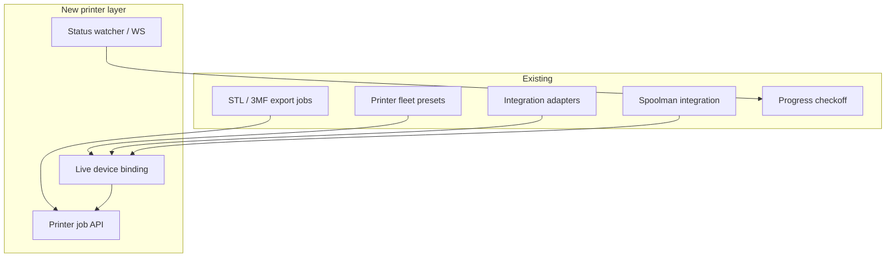

# Printer API research (Klipper / Prusa / Bambu)

Research brief for connecting Print Partner to live printers. **Phases A–E** ship Moonraker/PrusaLink `testConnection`, `getStatus` (including `complete`), `uploadFile`, fleet bind, Export send, Progress live strip, **verify-first Progress** (confirm/reject + outcomes), and **Bambu LAN MQTT status** (no default reverse-engineered print-start) — see [PRINTER_SETUP.md](PRINTER_SETUP.md). UX companion: [PRINTER_UX.md](PRINTER_UX.md).

Print Partner already has the right skeleton: pluggable integrations, working Moonraker + PrusaLink + Bambu (status) adapters, Spoolman, offline fleet presets for 3MF packing.

**Implemented extension points:** `IntegrationAdapter` includes `getStatus` and `uploadFile` (Moonraker/PrusaLink); Bambu implements `testConnection` / `getStatus` / `listDevices` over local MQTT; fleet entries bind via `integration_id` + `device_id`; job kind `printer-upload`; durable `printer.checkoff_links` + reconcile → `awaiting_verify` (L2 verify-first, not blind auto-tick).

## What Print Partner is today

- **Live send-to-printer ships for Moonraker and PrusaLink** (Export upload / start, Progress verify-first). Bambu is status-only over LAN MQTT.
- **No G-code generation.** Exports are slicer inputs (STL packs, packed 3MF). Materials in 3MF are display colors, not AMS/MMU maps ([3MF_EXPORT_VALIDATION.md](../3MF_EXPORT_VALIDATION.md)).
- **Spoolman is inventory**, not consumption: no weight deduction on Progress checkoff.
- **Self-host** can reach LAN printers (`allowPrivate: true` for Spoolman/Moonraker). **SaaS** generally cannot reach customer LANs without an on-prem agent/tunnel.
- **Moonraker auth:** untrusted clients must send credentials on HTTP (`Authorization: Bearer <JWT>` or `X-Api-Key: <key>`); WebSocket clients authenticate at connection setup / `server.connection.identify`, not via per-message headers. “Trusted clients” is a separate IP/domain allowlist mode in Moonraker config — not “open LAN by default.” Prefer HTTPS/WSS when credentials leave a trusted LAN; desk-v1 HTTP on a private LAN is still the common Moonraker setup. Store keys via integrations secret redaction; never log JWT/API-key material in errors or diagnostics.

The product gap that dominates every vendor discussion: **Print Partner plans kits; printers consume sliced jobs.** Integration value is highest where we bridge plan → sliced artifact → machine status → Progress checkoff — not where we pretend to be a slicer.

## Capability ladder

| Layer | What users get | Needs from us | Needs from printer API |
|-------|----------------|---------------|------------------------|
| L1 Monitor | Live status in Settings / Progress; “printing part X” | Poll or WS adapter; map device ↔ fleet slot | Status + job progress |
| L2 Auto-checkoff | When job completes, mark print units done | Durable mapping: `integrationId` + `deviceId` + remote job id + artifact hash; persist and reconcile via poll if WS events were missed | Reliable done/fail events |
| L3 Push file | Upload already-sliced `.gcode` / `.bgcode` / `.3mf` | Artifact-ref job (not inline bytes); size/timeout limits; upload vs start retry/idempotency (see [PRINTER_UX.md](PRINTER_UX.md) backend seams) | File upload + start |
| L4 Farm queue | Pick free printer by bed/filament match | Bind fleet presets to live devices; queue | Multi-device list + idle state |
| L5 AMS/MMU map | Role filament → AMS slot / Spoolman spool | Slot metadata + export mapping | Filament/AMS APIs |
| L6 Slice-to-send | One-click from Parts | Slicer pipeline or host plugin | Same as L3 after slice |

**Recommended build sequence:** L1 → L3 (upload + optional start) → L2 (auto-checkoff) → L5 (Spoolman/AMS) → L4 farm. Defer L6 unless Print Partner intentionally becomes a slicer orchestrator.

## Vendor deep dive

### 1. Klipper via Moonraker (best open fit)

**API:** Official HTTP + JSON-RPC + WebSocket ([Moonraker external API](https://moonraker.readthedocs.io/en/stable/external_api/introduction/)).

| Capability | How |
|------------|-----|
| Connect test | `GET /server/info` (already implemented in `moonraker.ts`) |
| Status | `printer.objects.query` (`print_stats`, `virtual_sdcard`, `display_status`); WS for push |
| Upload | `POST /server/files/upload` — `multipart/form-data` with required `file` part; optional `root` (default `gcodes`), `path`, `checksum`; optional `print=true` **only** when `root=gcodes`. Prefer upload-then-`start` over `print=true` when retry safety matters (reconcile remote file/job state before re-starting). |
| Start print | HTTP: `POST /printer/print/start?filename=…` (URL-encoded query param). JSON-RPC: `printer.print.start` with `params.filename`. Not a JSON HTTP body. |
| Pause / resume / cancel | `POST /printer/print/pause`, `/resume`, `/cancel` |
| Spoolman | Moonraker has first-class Spoolman integration — aligns with our Spoolman adapter |

**Unlocks**

- Self-host Voron / RatRig / custom farm: watch jobs, push sliced G-code, eventually auto-checkoff.
- Reuse fleet bed sizes in `web/apps/server/src/data/printer_presets.json`.
- Same Spoolman DB can drive kit planning and Moonraker’s active spool (`spoolman:{integrationId}:…` IDs).

**Limits**

- Still need a slicer (Orca / PrusaSlicer) to produce G-code.
- Auth: configure Moonraker for JWT and/or API keys (`Authorization: Bearer …` / `X-Api-Key: …` on HTTP; WS via connection identify) for any untrusted client; trusted-client mode is IP/domain-based and should not be assumed on shared networks. Multi-tenant SaaS still needs an edge agent to reach the LAN.
- One Moonraker = one Klippy instance (multi-printer = multi-hosts).

**Flexibility:** Highest of the three for open automation. Natural first production adapter beyond today’s probe.

### 2. Prusa — PrusaLink (local) vs Prusa Connect (cloud)

**PrusaLink (recommended Prusa path)**  
Official OpenAPI (`1.0.0-draft`), commit-pinned: [`spec/openapi.yaml` @ `337fabbd`](https://github.com/prusa3d/Prusa-Link-Web/blob/337fabbd581de28dce85f1bfb773c150128c6437/spec/openapi.yaml) (also tracked on [`master/spec`](https://github.com/prusa3d/Prusa-Link-Web/tree/master/spec)):

- Global **HTTP digest** auth (`digestAuth` in the OpenAPI `security` block)—not a simple static API-key header.
- Upload via `PUT /api/v1/files/{storage}/{path}` with optional `Print-After-Upload` header (`?1` = start after upload, `?0` = do not — RFC 8941 boolean; not `true`/`false`); start an existing file with `POST` on that path; job/status via `/api/v1/job` and `/api/v1/status`.
- Accepts printer-native formats (`.bgcode` / G-code depending on model).

**Unlocks:** Same L1–L3 story as Moonraker for MK3.9 / MK4 / XL / CORE One-class machines on LAN; stub adapter already reserved as `prusalink`.

**Prusa Connect (cloud)**

- Prusa documents a **per-printer API-key** path for uploading/starting G-code from PrusaSlicer / Prusa Connect (supported slicer→cloud send). That is not the same as a general third-party farm API.
- Broader public docs for multi-printer automation remain incomplete; community often relies on reverse-engineered endpoints or unofficial SDKs.
- Official public pieces beyond the slicer key flow tend to be narrower (e.g. camera upload OpenAPI, printer-side Connect SDK for *emulating* a printer).
- **Risk:** Fragile ToS / API surface if we treat undocumented Connect endpoints as a product feature.

**Buddy + Klipper:** Some Buddy-Klipper setups speak Moonraker-compatible APIs — fold those into the Moonraker adapter rather than PrusaLink.

**Stance:** Treat **PrusaLink as first-class** for LAN. Treat **Connect slicer API-key send** as an acknowledged Prusa path, but keep **Connect as research-only for Print Partner farm/automation** until Prusa publishes a stable partner API. Do not build a business feature on cookie-scraped Connect endpoints.

### 3. Bambu Lab (highest value, highest friction)

**Native format alignment:** Print Partner already emits 3MF packing aimed at Bambu-ish workflows — strongest *artifact* fit of the three, but current exports carry **display colors only** and do not encode AMS mappings.

**Access paths (2025–2026):**

| Path | Monitor | Start print / motion | Notes |
|------|---------|----------------------|-------|
| Local MQTT (`IP:8883`, user `bblp`, LAN access code) | Yes | Only with **LAN + Developer Mode** (cloud disabled) | Community-documented; ACS silently drops control otherwise |
| Cloud MQTT | Mostly status | Restricted | Token/account; poor for server-side farm control |
| **Bambu Connect** / signed network plugin | Via official channel | Yes (supported third-party path) | Required for many “send print” flows after ACS firmware |
| **Bambu Local Server + Printer Control API / Local SDK** | Yes | Batch control APIs | Official enterprise / on-prem path ([third-party integration wiki](https://wiki.bambulab.com/en/software/third-party-integration)) |

**Unlocks** (with a supported control path)

- Push packed 3MF; add AMS mapping only after the export includes printer-specific project metadata (L3+L5) — high value for multi-color kits.
- Farm status and pause/resume via Local Server APIs.
- Closer to “kit → plate → printer” than G-code hosts if the printer accepts project 3MF.

**Limits**

- Unofficial MQTT control is a policy/firmware landmine; fine for power-user self-host “Developer Mode”, poor as default SaaS.
- Official third-party print start increasingly expects **Bambu Connect** or **Local Server SDK** packaging.
- L5 role-filament → AMS slot mapping needs a **new export metadata contract** beyond today’s color-only 3MF before any adapter can apply it.

**Stance (Phase E shipped)**

- **Status-only** Bambu via local MQTT (`IP:8883`, user `bblp`, LAN access code + serial) is implemented; document Developer Mode / ACS for optional control and **do not** ship reverse-engineered print-start as the default product path.
- Medium term: evaluate **Local Server / official SDK** (or Connect) if farm/SaaS customers need supported send-to-print.
- Avoid reverse-engineered control as the primary path.

## Cross-cutting architecture

Concrete extension points already in-repo:

1. Widen `IntegrationAdapter` (`web/apps/server/src/integrations/store.ts`): `getStatus`, `uploadFile`, `startPrint`, optional `subscribe`.
2. Bind `printer.fleet` entries → `integrationId` + `deviceId`.
3. New job kinds (e.g. `printer-upload`) next to `export-3mf` / `export-stl-pack`.
4. Progress: durable “link print unit ↔ host job” for L2 (`integrationId` / `deviceId` / remote job id / artifact hash; poll to reconcile missed WS events).
5. Deploy mode: self-host LAN first; SaaS needs a **site agent** (outbound tunnel) — same SSRF rules as Spoolman.

**OctoPrint:** Not in contracts today. Moonraker covers the Klipper-native majority. Add OctoPrint only if demand appears.

## Feature unlock matrix

Vendor API *capability* (what the host/API can support). Print Partner ships Moonraker/PrusaLink status + upload, compatible farm match (same bed + filament preference), and Bambu status-only today; L5 AMS mapping and Bambu send remain open. Spoolman in Print Partner remains inventory-only ([SPOOLMAN.md](SPOOLMAN.md)).

| Feature | Moonraker | PrusaLink | Bambu (dev MQTT) | Bambu (official) |
|---------|-----------|-----------|------------------|------------------|
| Live status in UI | Strong | Strong | Strong | Strong |
| Auto-checkoff from job done | Strong | Strong | Medium | Strong |
| Upload sliced job | Strong (gcode) | Strong (bgcode/gcode) | 3MF/FTPS patterns | 3MF via Connect/SDK |
| Start/pause/cancel | Strong | Strong | Dev mode only | Supported |
| Spoolman / AMS bridge | Strong vendor hook (Moonraker↔Spoolman); PP bridge not built | Manual / MMU | AMS map in project | AMS via official APIs |
| Self-host LAN | Natural | Natural | Natural | Local Server |
| SaaS multi-tenant | Needs agent | Needs agent | Needs agent | Cloud or Local Server |

## Open product questions

1. **Primary persona:** single Voron/Prusa on a desk, or multi-printer farm?
2. **Slice boundary:** stay “export → slicer → we upload,” or invest in slice orchestration?
3. **Bambu appetite:** power-user Developer Mode, or only official Connect/Local Server?
4. **Success metric for v1:** live status + manual “upload this gcode,” or Progress auto-tick from completed jobs?

## Recommended stance when building

Shipped desk-v1: Moonraker/PrusaLink L1+L3+verify-first L2, Bambu L1 status-only, thin farm send-queue + **compatible L4 match** (same bed + filament preference). Still open:

1. **Official Bambu send** (Connect / Local Server) — not reverse-engineered MQTT print-start.
2. **L5 AMS/MMU mapping**.
3. **`startPrint` / pause / cancel / subscribe** beyond upload-with-start where hosts expose them.

Related code: `web/apps/server/src/integrations/adapters/moonraker.ts`, `prusalink.ts`, `bambu.ts`; fleet service `web/apps/server/src/services/printer-fleet.ts`.
