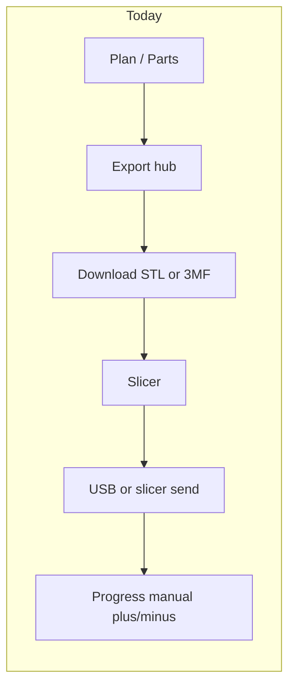
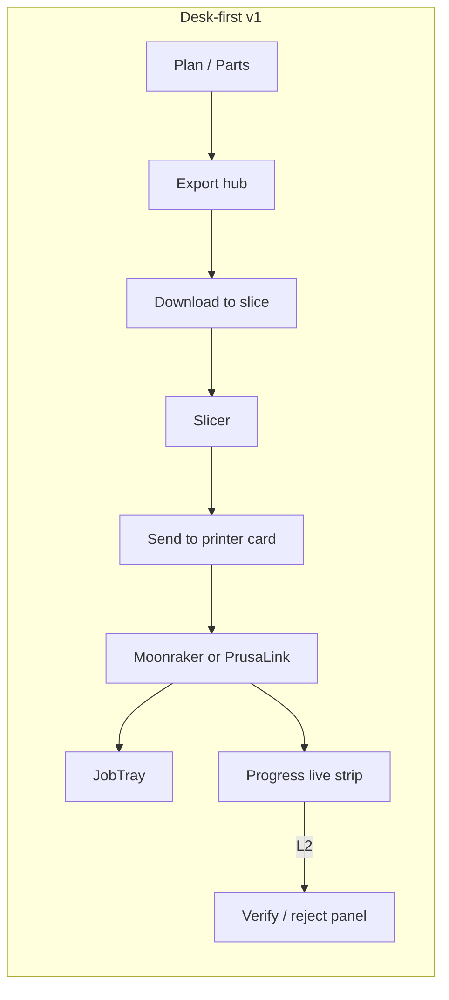
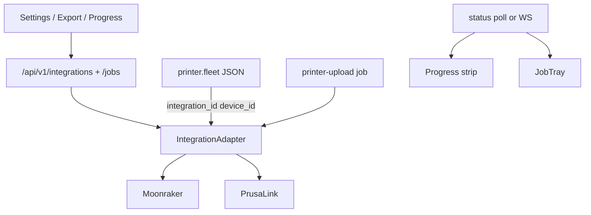

# Printer UX (desk-first v1)

Product and UX deep dive for live printer integration in Print Partner — how Moonraker / PrusaLink / Bambu bind into existing Settings, fleet, Export, Progress, and JobTray surfaces, what users see at each capability layer, and the concrete data/API seams.

**Phases A–F implemented (desk-first self-host):** Settings printer hosts + fleet bind + status pill; Export **Send to printer** + JobTray `printer-upload` (Moonraker/PrusaLink); Progress **live strip**; **verify-first Progress** when a host job completes (Phase D — confirm/reject + failure reasons); **Bambu LAN MQTT status** (Phase E); thin **farm send queue** (Phase F); **compatible farm match**; **Bambu Connect handoff** (official URL scheme). Setup walkthrough: [PRINTER_SETUP.md](PRINTER_SETUP.md). Vendor/API research: [PRINTER_APIS.md](PRINTER_APIS.md). Later: Local Server / Fleet Hub SDK (gated); L5 AMS mapping.

**Persona default:** desk-first self-host (one Voron/Prusa + optional Bambu status). Thin farm queue ships; multi-criteria farm auto-assign remains stretch. Slice boundary stays **export → external slicer → Print Partner uploads** (no in-app slicing in v1).

Print Partner remains the **kit brain**; the printer host remains the **job runner**. We connect them at Export (push) and Progress (watch → user verify).

---

## Today vs after (mental model)





---

## Where it lives in the product (reuse existing chrome)

| Surface | Today | With printers |
|---------|-------|----------------|
| Settings → Printer fleet | Offline bed/slots for 3MF | Same card + **Link host** + status pill |
| Settings → Optional integrations | Spoolman-only collapsed list | Split or add **Printer hosts** (Moonraker/PrusaLink; Bambu later) |
| Export hub | 6 download/nav cards | **7th card: Send to printer** |
| JobTray | Sync/export kinds | `printer-upload` row (“Uploading… / Printing on Voron…”) |
| Progress | Manual −/+ + header **live strip** | Host finish → **verify queue** (confirm/reject); −/+ still works |

No new app shell. Patterns already exist:

| Pattern | File |
|---------|------|
| Spoolman multi-row list | [`web/apps/web/src/components/settings/IntegrationsSettingsCard.tsx`](../../web/apps/web/src/components/settings/IntegrationsSettingsCard.tsx) |
| Export card grid | [`web/apps/web/src/components/export/ExportActionCards.tsx`](../../web/apps/web/src/components/export/ExportActionCards.tsx) |
| JobTray | [`web/apps/web/src/components/JobTray.tsx`](../../web/apps/web/src/components/JobTray.tsx) |
| Progress shop-floor UI | [`web/apps/web/src/pages/CheckoffPage.tsx`](../../web/apps/web/src/pages/CheckoffPage.tsx) |
| Offline fleet card | [`web/apps/web/src/components/settings/PrinterFleetCard.tsx`](../../web/apps/web/src/components/settings/PrinterFleetCard.tsx) |

Settings page order today ([`SettingsPage.tsx`](../../web/apps/web/src/pages/SettingsPage.tsx)): Printer fleet → AI assistant → Optional integrations (Spoolman). Printer hosts should sit as a peer accent card (like AI), not only inside the Spoolman `<details>`.

---

## Screen-by-screen: what it looks like

### 1. Settings — Printer hosts

**Layout:** New accent Card **“Printer hosts”** (peer of AI / above Spoolman), not buried only in the Spoolman collapsed list.

**Add Moonraker row**

- Name: `Shop Voron`
- Base URL: `http://192.168.1.40:7125` (desk-v1 LAN HTTP is normal; prefer HTTPS when the host exposes it)
- Auth: API key (password field) — Moonraker sends `X-Api-Key` or `Authorization: Bearer` for untrusted clients
- Actions: Enabled · **Test connection** → toast `Connected (klippy: ready)` · Delete (clears `integration_id` / `device_id` on any fleet rows that linked this host; no offline tombstone)

**Add PrusaLink row**

- Name / Base URL / Digest user+password (OpenAPI `digestAuth`)
- Test → printer name/state from `/api/v1/info` or `/api/v1/status`

**Bambu (Phase E):** status-only MQTT form (name, IP/host, LAN access code, serial). Test → `Connected (LAN MQTT · …)`. Control copy warns Developer Mode / official Connect-Local Server; Export send stays disabled for Bambu.

**Credentials:** store API keys / digest passwords / Bambu `access_code` with the existing integrations secret redaction in [`store.ts`](../../web/apps/server/src/integrations/store.ts) (`SECRET_KEYS` includes `access_code`). Never echo secrets in JobTray labels, connection-test toasts, or job error messages.

Spoolman stays filament inventory ([SPOOLMAN.md](SPOOLMAN.md)); hosts stay machines. Copy change: Optional integrations subtitle is no longer “Spoolman-only.”

### 2. Settings — Printer fleet (bind offline ↔ live)

Keep bed size + filament color ids (3MF packing). Per machine row in [`PrinterFleetCard.tsx`](../../web/apps/web/src/components/settings/PrinterFleetCard.tsx), add:

- **Link host:** Select `Shop Voron (Moonraker)` / `MK4 (PrusaLink)` / None
- **Status pill:** Idle · Printing 42% · Offline · Error (from `getStatus` / devices)
- Optional: show slot **labels** already in data but unused in UI

```text
┌ Printer fleet ─────────────────────────────────────┐
│ Voron 2.4  ·  Bed 350×350 × 345                     │
│ Host: Shop Voron ● Idle                             │
│ Slot 1 filament color id [ primary_abs     ]        │
└─────────────────────────────────────────────────────┘
```

**Data:** extend `PrinterMachine` ([`web/packages/domain/src/filament-assigner.ts`](../../web/packages/domain/src/filament-assigner.ts)) with optional `integration_id` + `device_id` (absent/`null` = unbound). Fleet load/save in [`printer-fleet.ts`](../../web/apps/server/src/services/printer-fleet.ts) must round-trip legacy `printer.fleet` JSON that omits these fields.

### 3. Export hub — “Send to printer”

New card in [`ExportActionCards.tsx`](../../web/apps/web/src/components/export/ExportActionCards.tsx) (today: six cards — STLs, missing STLs, print checklist, checklist HTML, share bundle, 3MF):

| | |
|--|--|
| Title | **Send to printer** |
| Description | Upload a sliced `.gcode` / `.bgcode` (or Bambu `.3mf` later) to a linked host |
| Chips | linked printers · upload · optional start · queue for idle |
| CTA | **Choose file…** → picker prefers **Idle** linked machines → Upload / Upload & start / **Queue for idle** |

Empty/disabled states:

- No linked host → button disabled + link **Manage printers in Settings…** (same pattern as 3MF already uses)
- File wrong type → toast
- Selected printer **Busy** → **Upload & start** blocked; **Upload** and **Queue for idle** still work; copy: “Selected printer is busy. Upload or Queue for idle still work; start is blocked until Idle.”

**Honest v1:** user still slices in Orca/PrusaSlicer; Print Partner is the LAN post office + status board. A follow-on “watch slicer folder” (`slicer_folder` stub in `IntegrationType`) can feed this card later.

### 4. JobTray — during send

Kind `printer-upload` · label **Send to printer** in [`jobLabels.ts`](../../web/apps/web/src/lib/jobLabels.ts):

```text
SEND TO PRINTER · Uploading frame_x.gcode to Shop Voron · 67%
SEND TO PRINTER · Printing on Shop Voron · 12%
SEND TO PRINTER · Complete
```

Same fixed footer chrome as exports ([`JobTray.tsx`](../../web/apps/web/src/components/JobTray.tsx)); Recent panel can include this kind if desired ([`ExportRecentPanel.tsx`](../../web/apps/web/src/components/export/ExportRecentPanel.tsx) filters by export kinds today).

### 5. Progress — live strip + verify-first checkoff

**L1 (Phase C — shipped):** sticky banner above filters on [`CheckoffPage.tsx`](../../web/apps/web/src/pages/CheckoffPage.tsx) via [`PrinterLiveStrip.tsx`](../../web/apps/web/src/components/checkoff/PrinterLiveStrip.tsx):

```text
Shop Voron · Printing · frame_x.gcode · 34% · ETA ~12m
Shop Voron · Idle
Shop Voron · Offline
```

Polls via reconcile (~5s while visible) for Moonraker/PrusaLink. **Bambu** linked hosts use status poll only (no verify queue from Bambu until send ships). Manual −/+ checkoff unchanged.

**L2 (Phase D — verify-first):** host success ≠ part accepted. When a mapped job completes, the link moves to `awaiting_verify` (toast: “finished filename — verify N parts”). [`PrintVerifyPanel.tsx`](../../web/apps/web/src/components/checkoff/PrintVerifyPanel.tsx) lists pending units: **Confirm printed** (patches Progress) or **Reject…** (reason tag + optional note; unit stays unprinted). Outcomes append to `printer.print_outcomes` for failure learning / summary.

**Phase F (thin farm queue):** Export **Queue for idle** when the selected printer is busy; Progress shows the same [`PrinterSendQueuePanel`](../../web/apps/web/src/components/export/PrinterSendQueuePanel.tsx) under the live strip (**Send ready** / **Send now** / Remove). Auto-drain runs when a host becomes Idle.

**Richer L4 matching:** Export **Any matching idle** enqueues with `match: "compatible"`. Drain/dispatch may reassign to another idle linked Moonraker/PrusaLink with the **same bed size** as the preferred fleet machine, preferring hosts whose loaded filament overlaps tracked Progress parts.

**Mapping at send time (Export → Send to printer):**

- Optional checkbox **Track for Progress verify when this print finishes** (default on when the active plan has missing units).
- Multi-select of missing parts; incomplete unit indices stored with the upload.
- Multipart: `profile_id` + `checkoff_units` JSON → durable `printer.checkoff_links`.

**Completion signal:** adapters expose `complete`. Cancel/error → `host_failed` (no Progress ticks). Reconcile is idempotent (`watching` → `awaiting_verify` | `host_failed`). Near-100% then idle still counts as success (missed brief `complete`). Manual −/+ remains additive.

---

## Backend seams (how it integrates)



Widen server [`IntegrationAdapter`](../../web/apps/server/src/integrations/store.ts) (today: `testConnection` + optional `listDevices` only):

- `getStatus(config)` → state, progress, filename, message, optional `eta_seconds`
- `uploadFile(config, artifactRef, filename, { start? })` — artifact reference or bounded stream, not inline job JSON bytes
- `startPrint` / pause / cancel as needed
- optional `subscribe` (Moonraker WS)

New job kind next to `export-3mf` in the jobs runner ([`web/apps/server/src/routes/jobs.ts`](../../web/apps/server/src/routes/jobs.ts)). Contracts: extend `IntegrationType` usage in UI (already has `moonraker` | `prusalink` | `bambu` in [`web/packages/contracts/src/index.ts`](../../web/packages/contracts/src/index.ts)); add a `JOB_KINDS` entry for `printer-upload`.

**Upload job contract (when Phase B lands):** single path — accept a bounded upload into a persisted artifact (max size + timeout TBD at implementation), then the runner references that artifact. Prefer **upload then optional start** as separate steps (or reconcile host state after a timed-out start) so retries do not double-start a print. Define cleanup and idempotency for host-accepted uploads that time out client-side.

**Outbound SSRF:** every printer adapter operation (`getStatus`, `listDevices`, `uploadFile`, `startPrint` / pause / cancel, `subscribe`) must call the existing [`assertSafeOutboundUrl`](../../web/apps/server/src/lib/outbound-url.ts) guard — not only the initial connect URL. Self-host uses `allowPrivate: true` (same as today’s Moonraker/Spoolman probes); cloud metadata stays blocked. SaaS: later site-agent; out of desk-v1 scope. See [ARCHITECTURE.md](../ARCHITECTURE.md) and [API.md](../API.md).

Adapter implementations: [`moonraker.ts`](../../web/apps/server/src/integrations/adapters/moonraker.ts), [`prusalink.ts`](../../web/apps/server/src/integrations/adapters/prusalink.ts), [`bambu.ts`](../../web/apps/server/src/integrations/adapters/bambu.ts). `getStatus` / `uploadFile` ship for Moonraker/PrusaLink; Bambu is status-only. Still open on the adapter surface: dedicated `startPrint` / pause / cancel / `subscribe`.

---

## Capability → UI mapping (phased)

| Phase | Capability | User-visible |
|-------|------------|--------------|
| **A** | Hosts + Test + fleet bind + status pill | Settings only |
| **B** | Upload / upload&start + JobTray | Export 7th card |
| **C** | Live strip on Progress | Progress header (shipped) |
| **D** | Verify-first on job done | Progress verify panel + reject reasons (shipped) |
| **E** | Bambu status (LAN MQTT) | Hosts form + fleet/Progress status (send deferred) |
| **F** | Farm send queue (thin) | Export + Progress: Idle picker, **Queue for idle**, **Send ready** / **Send now**, auto-drain on Idle |
| **L4+** | Compatible farm match | Export **Any matching idle** — same bed + filament preference on drain |
| **Connect** | Bambu Connect handoff | Export **Open in Bambu Connect** — stage `.3mf`/`.gcode`, `bambu-connect://import-file` (no MQTT start) |

Recommended ship order matches research in [PRINTER_APIS.md](PRINTER_APIS.md): **A → B → C → D → E → F** (thin), then richer L4 matching / official Bambu Connect handoff. Phase mapping to the research ladder: **A** ≈ L1 (Settings status), **B** ≈ L3 (upload), **C** ≈ L1 on Progress, **D** ≈ L2 (verify-first, not blind auto-tick), **E** ≈ L1 Bambu, **F** ≈ thin L4 queue, **L4+** ≈ bed/filament farm match, **Connect** ≈ official Bambu send path.

---

## What we will not pretend

- Print Partner does not replace the slicer in desk-v1.
- Fleet presets alone are not live printers ([ARCHITECTURE.md](../ARCHITECTURE.md) already says this).
- Bambu “send” is not a silent MQTT hack in default product copy.
- Spoolman weight will not auto-deduct on checkoff until a separate, opt-in feature ([SPOOLMAN.md](SPOOLMAN.md)).

---

## See also

- [Printer setup & debugging](PRINTER_SETUP.md) — add hosts, link fleet, send a file, common failures
- [Printer API research](PRINTER_APIS.md) — vendor capability ladder, Moonraker / PrusaLink / Bambu stance
- [Spoolman integration](SPOOLMAN.md) — filament inventory (hosts stay separate)
- [Architecture](../ARCHITECTURE.md) — integrations and fleet presets
- [HTTP API](../API.md) — `/api/v1/integrations`, jobs
