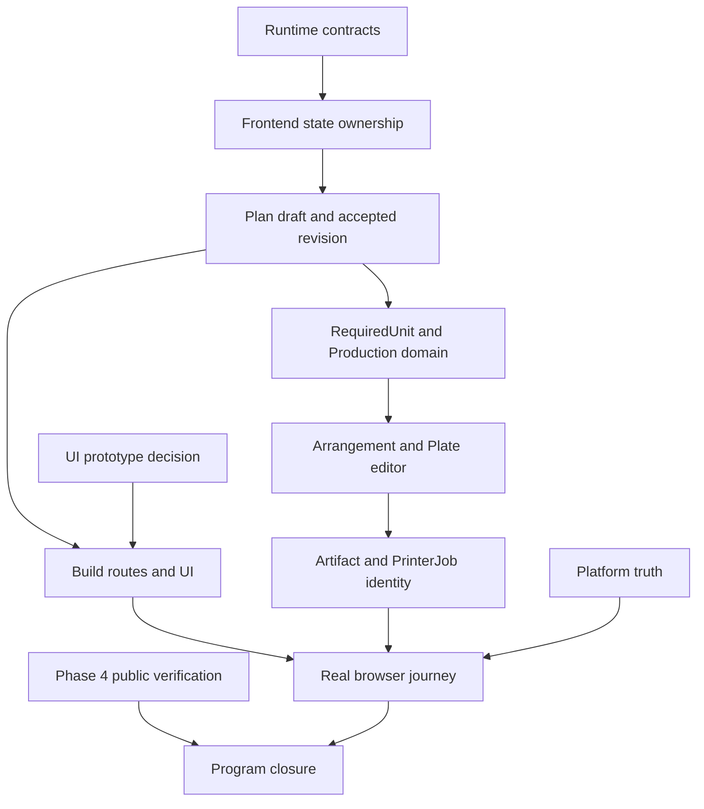

# Remaining stabilization gap map

## Purpose

This reference records the verified state of Phases 5 through 11 on August 20,
2026. It replaces the assumption that every later phase is untouched. Use the
individual phase files for accepted requirements and this file for current
status, dependencies, and implementation units.

This table is a dated snapshot from August 20. Implementation continued after
that date on the stabilization branch; do not use this file as live status.

## Status

| Phase | Status | Verified gap |
|---|---|---|
| 5. API contracts | Partial | Source naming routes and persistence exist, but the browser trusts unparsed JSON and the shared package has no runtime naming contract. Invalid folder rules and invalid default quantities can reach storage. |
| 6. Frontend state ownership | Partial | Query modules exist, but `SourcesPage` and `BuildPage` keep competing Source snapshots. `PlanWorkspaceContext.revision` is a refetch counter, not a Plan revision. |
| 7. Workflow model | Partial | Accepted Source input provenance exists. A durable Plan draft, an accepted parts Plan revision, an idempotent apply command, and rebase do not exist. |
| 8. Site structure | Landed | Canonical routes, Global vs Build Production, Builds restore/counts, hybrid catalog, calm/dense density, and IncomingShares on Builds are in code. Optional filename renames (PartsPage/ExportPage) remain. |
| 9. Production workspace | Partial | Translation-only placement, named-object 3MF, STL bundles, printer observation, verification, no first-printer Send fallback, one Spoolman deduction per Printer job, ambiguous Object-name confirmation, pin, Arrange unplaced, undoable Arrange all, and return-to-unplaced exist. Remaining: move units across Plates or Printers; Printer identity without a required connection; Settings copies of Printer and Library. |
| 10. End-to-end proof | Partial | Screenshot capture script targets current Builds/Sources/Plan/Checkoff/Production routes. Catalog and density were proven in a real browser. A genuine slicer-derived Object-name fixture and README PNG recapture still need an installed slicer and representative data. |
| 11. Platform boundary | Landed | Health reports a deployment capability. Docs name SQLite + local disk + in-process jobs as supported. Redis/BullMQ claims removed. SaaS Postgres and S3 stay experimental. |

Phase 4 has passed local release checks at commit `fbef877`. Public release
verification remains open until an authorized push of `main` and annotated tag
`v3.2.0` proves the GitHub Release and GHCR image identity.

## Facts that change the original sequence

- `PUT /sources/:id/naming` already exists. Phase 5 must make its contract and
  validation authoritative instead of adding the route again.
- `plan_revision_input_sets` records Source input provenance. It is not the
  accepted parts Plan revision required by Phase 7.
- A saved `KitPlateLayout` stores membership but not X and Y positions. Preview
  and export can repack the same Plate differently.
- Duplicate STL basenames stay unmatched and require confirmation before send.
  Phase 10 must not certify silent first-match mapping.
- The supported deployment is one self-hosted process with SQLite, local disk,
  and an in-process job runner. Database rows and local artifacts can survive a
  restart. In-flight job state cannot.

## Dependency order

## Throughput checkpoint

### Blocking first steps

- Make Source naming the first runtime-validated API family.
- Give Source and Plan server state one frontend cache and invalidation policy.
- Add the Plan draft and accepted Plan revision boundary before route or Plate
  work changes user-visible ownership.

### Independent workstreams

- Correct current platform documentation without changing deployment code.
- Build three UI prototypes with the same workflow fixture and compare their
  visual system and action hierarchy.
- Prepare genuine slicer fixtures only after Object identity is final.

### Shared mutable state

- Contract work shares `web/packages/contracts/src/index.ts` and
  `web/apps/web/src/api/engine.ts`.
- Plan and Production persistence share both database schemas, migrations, and
  `web/apps/server/src/db/repository.ts`.
- Route and UI work share `App.tsx`, route helpers, navigation, theme files, and
  the large current pages.
- Documentation work shares the public README, deployment guides, architecture
  guide, and release notes.

Do not run writers against the same shared files at the same time.

### Smallest safe decomposition

1. Add the shared Source naming contract and close its validation gaps.
2. Add the parsed, redacted browser transport boundary.
3. Consolidate Source and Plan query ownership.
4. Add the durable Plan draft, accepted Plan revision, RequiredUnit identity,
   expected-version apply, idempotency, and rebase service.
5. Move Source picks and part requirement edits into the Plan draft.
6. Add one deployment capability descriptor and correct platform claims.
7. Compare and choose the UI visual direction.
8. Migrate the shell and Build routes.
9. Correct Printer identity, optional connections, and manual allocation.
10. Add durable Plates, placements, validation, and the arrangement engine.
11. Add the Plate editor, immutable exports, and Printer job matching.
12. Move production operations and Checkoff report outputs to their accepted
    owners.
13. Add the real-stack browser journey, slicer-derived fixture, screenshots,
    and final documentation.

## Verification predicates

| Unit | Predicate |
|---|---|
| Source naming contract | Valid rules round-trip. Invalid folder rules and default quantities return `400` without changing stored metadata. A missing Source returns a parsed `404`. |
| Browser transport | Malformed success, malformed error, HTTP failure, and transport failure produce distinct redacted errors. Secrets do not appear in errors or request logs. |
| Query ownership | One Source mutation updates the Sources page, a nested Build panel, and the workflow indicator without a reload. |
| Plan lifecycle | Two concurrent applies against one accepted revision create exactly one new revision. An identical retry returns the first result. A changed payload under the same key fails. An injected write failure changes no accepted state. |
| Build routes | A new Build opens Sources. An existing Build opens Plan. Archive and restore preserve Plan, Checkoff, Plate, and Printer job history. |
| Plate foundation | One Required unit cannot belong to two active Plates. Saved placements reopen unchanged. Invalid spacing, bounds, overlap, or height blocks export. |
| Artifact identity | Every exported Object name resolves to one Required unit or an explicit ambiguity. A Printer job keeps the mapping from its original immutable export after later Plate edits. |
| Checkoff outputs | The electronic view, paper view, PDF, CSV, and Excel exports represent the same Required units and completion state. |
| Full journey | The real application carries one Build from Source revision through accepted Plan, Plate export, observed Printer operation, Awaiting verification, confirmed completion, restart, and stale Plan detection. |

## First implementation unit

The first unit is Source naming contract authority. It includes:

- shared runtime parsers and inferred types for the Source naming `PUT` input,
  the `GET` and `PUT` output, and the endpoint error;
- structural checks for folder rules and a finite integer default quantity of
  at least one;
- server route tests for invalid input, unchanged storage, and missing Sources;
- browser parsing before feature code receives Source naming data; and
- removal of the migrated browser-local Source naming definitions.

The general `engineFetch` error redesign is the next unit. Keeping it separate
limits the first unit to one endpoint family and avoids changing every API call
before the parser pattern is proven.

## Decisions to make when their dependency is ready

- Choose the UI visual direction and Production action hierarchy after the
  three prototypes use identical fixtures.
- Define the direct-export artifact before the Production API is designed.
- Choose the supported slicer and minimum fixture version before Phase 10.
- Choose the local **Open with...** mechanism only after the browser capability
  boundary is tested.
- Keep SaaS experimental unless a separate program funds durable workers,
  shared artifact storage, and tenant-aware execution.
